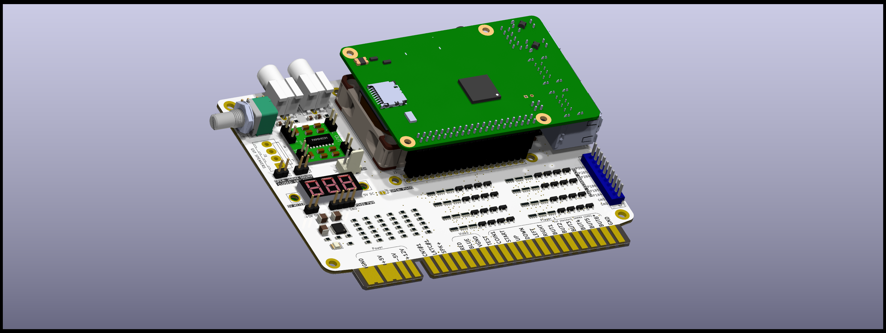
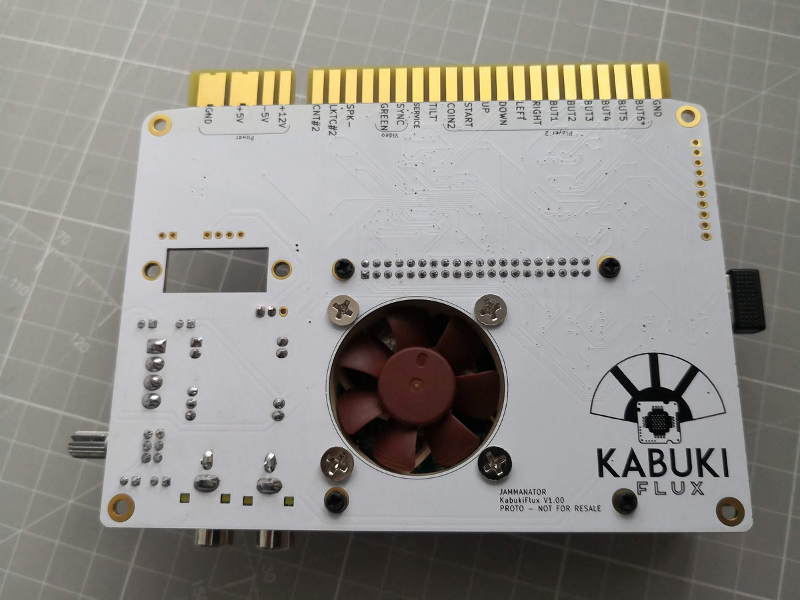
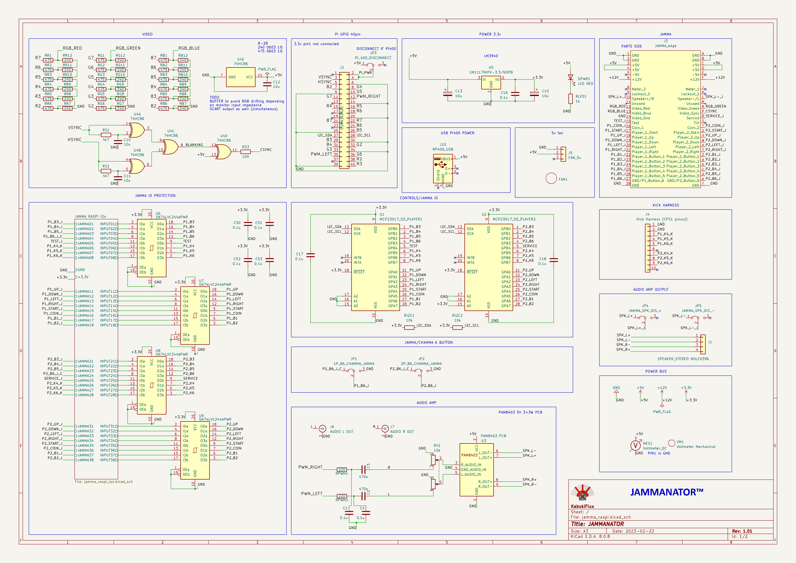
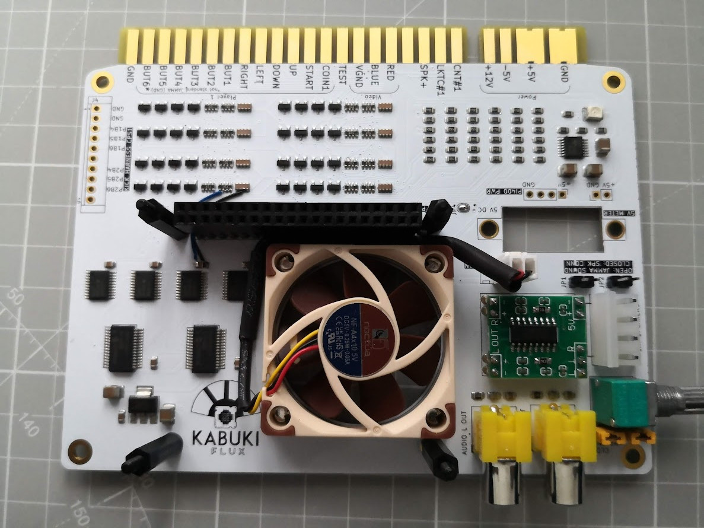
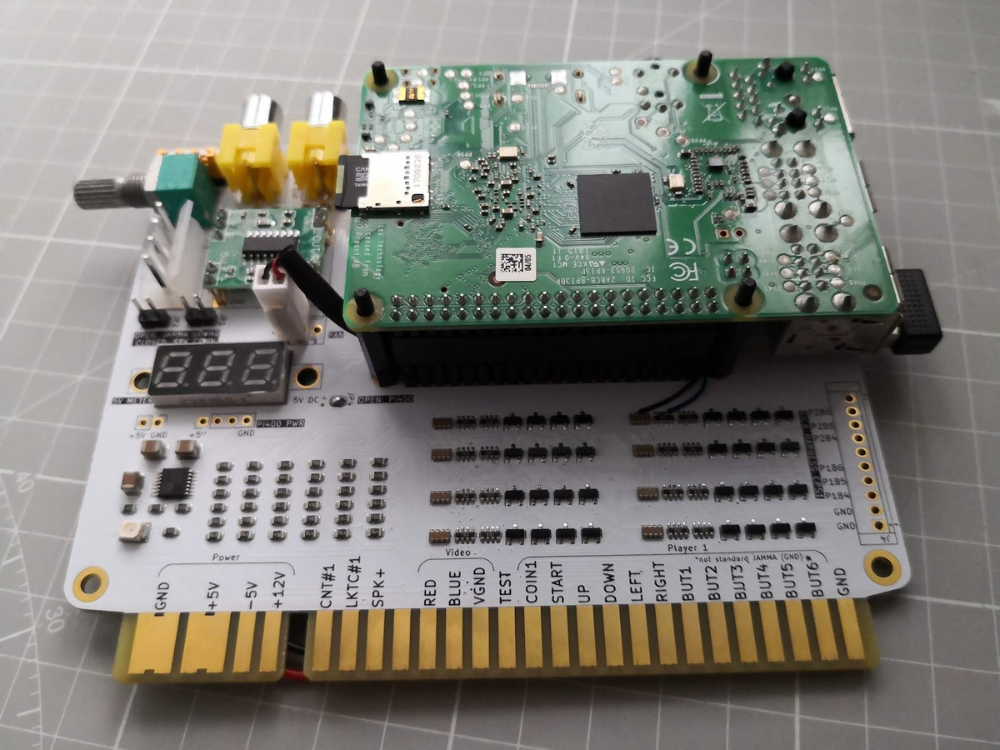

# Raspberry pi jamma bard "jammanator"

<b align="center">Jammanator, the Raspberry Pi JAMMA output board 
for your cabinet</b>

## Table of contents

- [Why](#why)
- [Description](#description)
- [Schematics](#schematics)
- [Install](#install)
- [Pics and final result](#pics-and-final-result)

## Why?

This was done during some live events on Twitch.tv and tested for some time.

This is a very old design for Raspberry Pi 3B+, 4, 400, it no longer 
has the status that anybody can make money and make profit of it 
so I decided to publish it, if you have an arcade cabinet with JAMMA
a spare Raspberry Pi 3B+ or 4 and you want to have something running
then is a matter of burning the rgbpiOS or the recalboxOS and you have
everything you need to make it work.

## Description

This board is intended to be a PCB used with a Raspberry Pi and a 4x4 5v fan
to remove some heat from the CPU.

This board uses 2 I2C parallel expansion I/O chips connected to the JAMMA
connector in order to map automatically the buttons to the cabinet with no
configuration required.

A voltmeter has been added to check the 5v rail while running.

A protection circuit has been mapped to all the inputs and an extra buffer
to avoid any loss of the I2C bus, if the I2C bus is lost the Raspberry will 
no longer boot the OS (yellow led) this design will avoid that.

In the BOM directory there's an interactive BOM with all the required components.

In the gerbers directory we have the gerbers to manufacture the boards.

In the KiCAD folder we can find the KiCAD project itself.

In the circuit_js folder you can find the simulation for the I/O protection.

## Schematics

This is the schematics.

## Install

If you use a Raspberry Pi 400 (the one with the keyboard) I recommend this
board and the extender in order to use it (check carefully the connector position):

- [GPIO board](https://www.amazon.es/IBest-Waveshare-Raspberry-Color-Coded-Expansion/dp/B08SK71PB4)

- [Extension cable](https://www.amazon.es/vhbw-extensi%C3%B3n-compatible-Raspberry-miniordenador/dp/B0B94KRZ8Z)

Ensure the RP400 pin is in the right position, as the RP400 cannot be powered
via the GPIO we must provide USB-C power and avoid sending power to the GPIO.

1- Send to manufacture the GERBER board to [JLCPCB](https://jlcpcb.com/) or other PCB manufacturer.

2- Get the components required, you can see here the Bill Of Materials [BOM](bom/ibom.html)

3- Solder the components.

4- Connect a Raspberry Pi with [rgbpi-OS](https://ko-fi.com/s/4119fb48b8) or 
[recalbox-OS](https://www.recalbox.com/es/download/stable/rpi/)

5- Follow the installation guide and instructions for the selected OS. 

Once finished you should have something like this:

### Pics and final result

I'm not responsible
============
And yes, read below, no liability is assumed for misuse.

DISCLAIMER (See Licensing)
==========================
See LICENSE fo more information.
